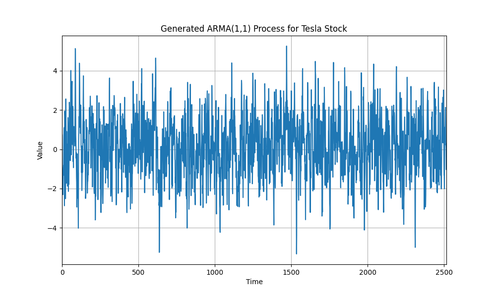
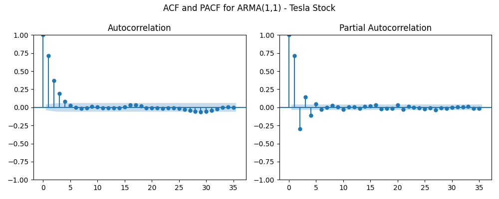
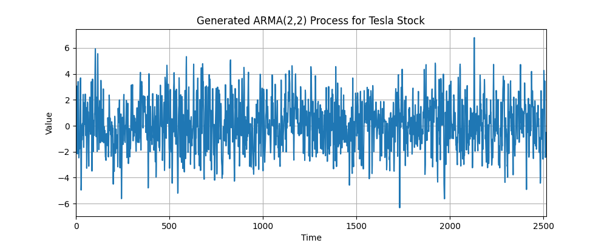

# NAME: Pranave B
# REG NO: 212221240040

# Ex.No:04   FIT ARMA MODEL FOR TIME SERIES
 

### AIM:
To implement ARMA model in python.

### ALGORITHM:
1. Import necessary libraries.
2. Set up matplotlib settings for figure size.
3. Define an ARMA(1,1) process with coefficients ar1 and ma1, and generate a sample of 1000

data points using the ArmaProcess class. Plot the generated time series and set the title and x-
axis limits.

4. Display the autocorrelation and partial autocorrelation plots for the ARMA(1,1) process using
plot_acf and plot_pacf.
5. Define an ARMA(2,2) process with coefficients ar2 and ma2, and generate a sample of 10000

data points using the ArmaProcess class. Plot the generated time series and set the title and x-
axis limits.

6. Display the autocorrelation and partial autocorrelation plots for the ARMA(2,2) process using
plot_acf and plot_pacf.

### PROGRAM:
```python
import numpy as np
import matplotlib.pyplot as plt
import pandas as pd
from statsmodels.tsa.arima_process import ArmaProcess
from statsmodels.graphics.tsaplots import plot_acf, plot_pacf

# Load the Tesla stock dataset
file_path = 'tsla_2014_2023.csv'  # Path to your uploaded file
data = pd.read_csv(file_path)

# Extract the 'close' price column for modeling
data_values = data['close'].dropna().values

# 1. ARMA(1,1) Process for Tesla Stock Data

# Define AR and MA coefficients for ARMA(1,1)
ar1 = np.array([1, -0.5])  # AR(1) coefficient
ma1 = np.array([1, 0.5])   # MA(1) coefficient

# Generate a sample based on the length of Tesla stock data
arma11_process = ArmaProcess(ar1, ma1)
arma11_sample = arma11_process.generate_sample(nsample=len(data_values))

# Plot the ARMA(1,1) time series for Tesla stock data
plt.figure(figsize=(10, 6))
plt.plot(arma11_sample)
plt.title('Generated ARMA(1,1) Process for Tesla Stock')
plt.xlabel('Time')
plt.ylabel('Value')
plt.xlim(0, len(arma11_sample))
plt.grid(True)
plt.savefig('arma11_time_series.png')  # Save the time series plot
plt.show()

# Display ACF and PACF plots for ARMA(1,1)
plt.figure(figsize=(10, 4))
plt.subplot(121)
plot_acf(arma11_sample, lags=35, ax=plt.gca())
plt.subplot(122)
plot_pacf(arma11_sample, lags=35, ax=plt.gca())
plt.suptitle('ACF and PACF for ARMA(1,1) - Tesla Stock')
plt.tight_layout()
plt.savefig('arma11_acf_pacf.png')  # Save the ACF and PACF plot
plt.show()

# 2. ARMA(2,2) Process for Tesla Stock Data

# Define AR and MA coefficients for ARMA(2,2)
ar2 = np.array([1, -0.7, 0.3])  # AR(2) coefficients
ma2 = np.array([1, 0.5, 0.4])   # MA(2) coefficients

# Generate a sample based on the length of Tesla stock data
arma22_process = ArmaProcess(ar2, ma2)
arma22_sample = arma22_process.generate_sample(nsample=len(data_values))

# Plot the ARMA(2,2) time series for Tesla stock data
plt.figure(figsize=(10, 4))
plt.plot(arma22_sample)
plt.title('Generated ARMA(2,2) Process for Tesla Stock')
plt.xlabel('Time')
plt.ylabel('Value')
plt.xlim(0, len(arma22_sample))
plt.grid(True)
plt.savefig('arma22_time_series.png')  # Save the time series plot
plt.show()

# Display ACF and PACF plots for ARMA(2,2)
plt.figure(figsize=(10, 4))
plt.subplot(121)
plot_acf(arma22_sample, lags=35, ax=plt.gca())
plt.subplot(122)
plot_pacf(arma22_sample, lags=35, ax=plt.gca())
plt.suptitle('ACF and PACF for ARMA(2,2) - Tesla Stock')
plt.tight_layout()
plt.savefig('arma22_acf_pacf.png')  # Save the ACF and PACF plot
plt.show()

```

### OUTPUT:
# SIMULATED ARMA(1,1) PROCESS:


# Autocorrelation,  Partial Autocorrelation


# SIMULATED ARMA(2,2) PROCESS:


# Autocorrelation, Partial Autocorrelation


# RESULT:
Thus, a python program is created to fir ARMA Model successfully.
